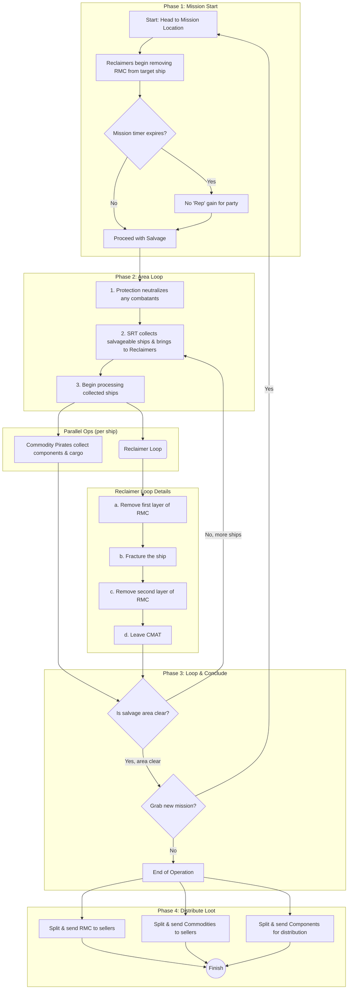
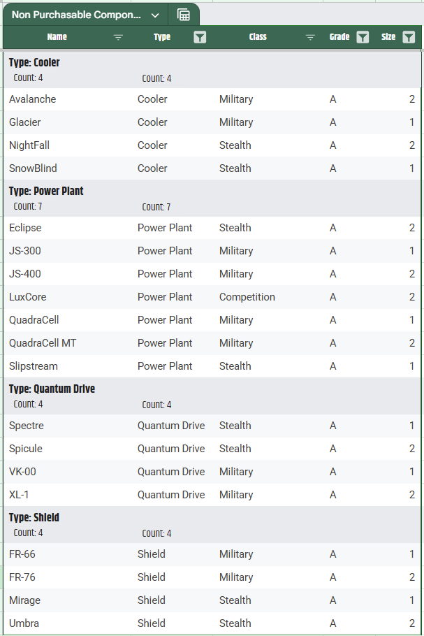
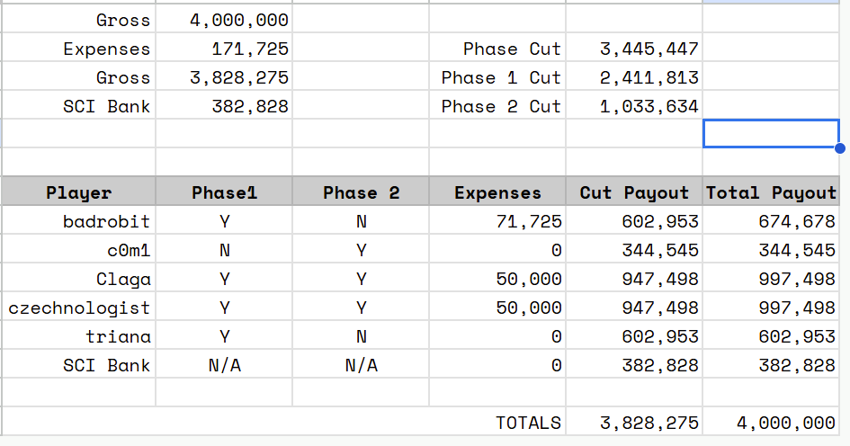

A high level overview of how salvage operations (org events focused on salvage) will go

## Salvage "Squadron"
The breakdown of the ships that should be fielded for any salvage operation

- 1/2 [Aegis Reclaimers](https://starcitizen.tools/Reclaimer) (NO MORE THAN 2!! until we build up enough reclaimer crews)
	- For the loadout `@badrobit` uses [Abrades Scraper Modules](https://uexcorp.space/items/info?name=abrade-scraper-module) for the salvage beam and their full [Reclaimer configuration can be found here](https://www.erkul.games/loadout/5ReFh8P5)
	- Due to the size of the targets we will be getting from the missions [`Drake Vultures`](https://starcitizen.tools/Vulture) and [`MISC Fortunes`](https://starcitizen.tools/Fortune) do not really fit here but if there is a desire for a similar event focused around smaller salvage reach out to `@badrobit` and he will happily help scale this for that setup
- 1 [Standard Recovery Vehicle](https://starcitizen.tools/SRV) (for every 3 reclaimers or per estimated operational area density) 
- 1 Cargo Ship ([Crusader C2 Hercules Starlifter](https://starcitizen.tools/C2_Hercules_Starlifter)or better)
	- A [Drake Caterpillar](https://starcitizen.tools/Caterpillar) may work but they don't hold 32 SCU boxes on the grid you can contain them but they will not be snaped down
	- Optional Protection (ideally this is combined with the cargo ship via a [Polaris](https://starcitizen.tools/Polaris) or [Ironclad](https://starcitizen.tools/Ironclad))

### Mission Positions

Total seats for phase1: 11

- `Reclaimer #1`: 
  - 1 Pilot/Arm Operator  
  - 1 Left Salvage Turret Operators / Remote Gun Turret Operators 
  - 1 Right Salvage Turret Operators / Remote Gun Turret Operators 
  - 1 stevedore/Gun Turret Operator/Commodity Pirate
- `Reclaimer #2`: 
  - 1 Pilot/Arm Operator  
  - 1 Left Salvage Turret Operators / Remote Gun Turret Operators 
  - 1 Right Salvage Turret Operators / Remote Gun Turret Operators 
  - 1 stevedore/Gun Turret Operator/Commodity Pirate
- `Cargo`: 
  - Pilot/Cargo 
  - Co-Pilot/Cargo
- `SRV`: 
  - Pilot

## General Salvage Mission 

This is mostly targeting running the Headhunters salvage missions (`50K aUEC COST`, `(Quickly) Clear CFP Convoy`). This is focused around high profitability so we want highly focused teams running a tight **3 hour time limited mission** (for phase 1 and 1a. The reason for this is two fold, one it helps us determine how awesome we are being the second is one of the major resources we will require for base building and crafting is construction material. Salvage is currently the best known way to get our hands on it. 

The `(Quickly) Clear CFP Convoy` spawns the following target ships for us to salvage: 

- [Aegis Hammerhead](https://starcitizen.tools/Hammerhead)
- [Crusader A2 Hercules Starlifter](https://starcitizen.tools/A2_Hercules_Starlifter)
- [Crusader C2 Hercules Starlifter](https://starcitizen.tools/C2_Hercules_Starlifter)
- [Crusader M2 Hercules Starlifter](https://starcitizen.tools/M2_Hercules_Starlifter)
- [Drake Caterpillar](https://starcitizen.tools/Caterpillar)
- [MISC Starfarer](https://starcitizen.tools/Starfarer)

A Salvage run is broken up into 3 phases: 

### Phase0: Organization (Event Planners)

- Determine who will be doing the selling of the `RMC` and `Commodities` 
- Determine who will be managing the distribution of `Components`
- Create and distribute the [Regolith Co](https://regolith.rocks/) session for the event.
	- Create seats for everyone in the event so we can more easily track who is owed what by whom

### Phase1: Salvage (RMC/CMAT/Commodities/Components)
Perform the following on a bit of a loop:

- Head to mission location 
- Reclaimers remove `RMC` from the ship the mission timer is tied to (if the timer expires there will be no "rep" gain for the party members)
- Area Loop: 
	- Protection neutralize (soft death only!!) any combatants in the salvage ops area
	- SRT collect any salvageable ships from the region and bring them to the area where the reclaimer(s) are operating
	- Commodity Pirate (with the transport team) collect any components or commodities from the mission ships worth collecting for sale/distribution to org members (for ship components)
	- Reclaimer Loop: 
		- Remove first layer of `RMC` 
		- Fracture the Ship 
		- Remove the second layer of `RMC` 
		- NOTE: `CMAT` (It is at the discretion of the mission organizer and reclaimer commanders)
	- Repeat the `"Area Loop"` as many times until the salvage ops area is clear and then grab a new mission and restart this phase. 
- End of Operation: 
	- Split/Send `RMC` to the team members who will be selling the `RMC`
	- Split/Send `Commodities` to the team members who will be selling the `Commodities` 
	- Split/send `Components` to the storage of the team members who will be distributing the `Components` 

### Phase1a: Transportation (during mission Ops) 
This is specifically for the Cargo team. Your goal is to offload as many `Commodities` and `Components` from the mission ships and derelicts in the area of operations.               
> [!WARNING]
> Most of the ships spawned for the `(Quickly) Clear CFP Convoy` contain mostly [`Size 3` or `Size 4` ](https://starcitizen.tools/Ship_components#Size_Categories)components which cannot be looted from ships. You will not be able to pull anything other than externally mounted `guns`, `missiles`. 
>
> There is also a risk that the components are damaged and in need of repair. The recommendation is to repair them before pulling them as you will either need to repair them with a [Cambio SRT](https://uexcorp.space/items/info?name=cambio-srt) / [Cambio-lite SRT Attachment](https://uexcorp.space/items/info?name=cambio-lite-srt-attachment)  in order to repair the component.  

> [!NOTE]
> Ideally the reclaimers will also be emptied at a semi-regular pace to keep any potential losses of RMC due to piracy as low as possible. 

At the moment here is the priority for the most common commodities we are seeing: 

Note: Prices change frequently check [UEX](https://uexcorp.space/) for up-to-date values

Take without Question: 

- [Gold (`5,900 αUEC/SCU`)](https://uexcorp.space/commodities/info/name/gold/tab/locations_buying/)
- [Medical Supplies (`3,700 αUEC/SCU`)](https://uexcorp.space/commodities/info/name/medical-supplies/tab/locations_buying/)
- [Scrap (`1,700 αUEC/SCU`)](https://uexcorp.space/commodities/info/name/scrap/tab/locations_buying/)

Grab if present in quantities of 24 SCU or higher (this helps to offset the time cost of selling for bulk sales)

- [Iron (`377 αUEC/SCU`)](https://uexcorp.space/commodities/info/name/iron/tab/locations_buying/)
- [Copper (`345`)](https://uexcorp.space/commodities/info/name/copper/tab/locations_buying/)
- [Quartz (`370 αUEC/SCU`)](https://uexcorp.space/commodities/info/name/quartz/tab/locations_buying/)
- [Processed Foods (`367 αUEC/SCU`)](https://uexcorp.space/commodities/info/name/processed-food/tab/locations_buying/)

For a components list please see [this Google Sheet](https://docs.google.com/spreadsheets/d/1fFTnvQc8_i9lur4PB3txqipK1ljRkOgw6kTEimx3xdg/edit?gid=1063603809#gid=1063603809) and make real-time calls as you go. Some general guidelines (the A tier components we could be looking for in size 1/2 are listed in the table below)

- grab anything tier A of any component type of size 1 or 2 
- Grab any and all components requested by org team members 
	- method for org members to make these requests TBD 
	- Tool for accessing the list of requests so you know what to grab also TBD

For the google sheet select the "Non Purchasable Components" sheet and create a view grouped by type and then in the header for each column enable the following: 

- Type: 
	- Shield
	- Quantum Drive
	- Power Plant
	- Cooler 
- Grade: 
	- A 
- Size: 
	- 1
	- 2

This should provide you with a view as seen in the following screenshot that reduces your list to only the parts that you cannot buy in a store, that can be looted and that are tier "A": 

### Phase 2: Transportation (to sale site)

Once a suitable amount of materials have been accumulated they should be moved (in bulk, ideally with protection if hauling using something like a C2, a Hull-C could be an option but we should stick to C2's until we hit transport quantities that make such a ship make sense). Our goal here is to max out our return so we want to target the area that can take all found cargo box sizes (and printed ones) but may not be able to take them all in one order. If somewhere cannot take the full quantity it is to be stored at the selling location in the hanger of the team member who will be responsible for ensuring the total quantity is sold. 

### Phase3: Sale/Team Payout

Payment Breakdown: 

- The Org Bank will take a `10%` cut of gross revenue. 
- Phase Cut: Net - Expenses - SCI Bank
	- Phase 1: `70%` of the Phase Cut
	- Phase 2: `30%` of the Phase Cut

Given that the team member who accepts the mission will be paying `50,000 αUEC` out of pocket that is to be listed on the largest `RMC` workorder as an expense to that team member. We will be providing a tool to the team member running each event to make managing this easier

An example of the payout for a 5 member crew can be seen here: (I started to find some irregularities in regolith sadly)

Any team member responsible for selling any commodities or `RMC` will make every effort to make the sale within 1 week of the event date. Each seller will track the commodity they are selling through a work order on Regolith and mark when the `RMC` or Commodities have been sold and indicate when the funds have been transferred. 

#### Loss of Cargo 
If you are handling the sale of any materials and lose the cargo for any number of reasons please mark your work order as failed and message the event organizer letting them know why it was failed (you can also indicate this when you mark the work order as failed in regolith).  This is just part of playing star citizen and even if the game worked perfectly there are pirates out there so sometimes there is just no getting the material to the point of sale. 

[`Components`]: https://starcitizen.tools/Ship_components 